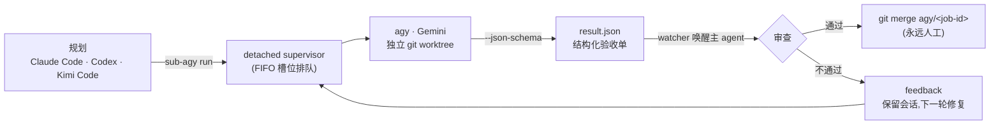

# sub-agy

> 在 **Claude Code / Codex / Kimi Code** 里规划,交给 **Antigravity CLI**(Gemini)执行 —— 全程只用官方 CLI。

[English](./README.md) | **简体中文**


`sub-agy` 把 Antigravity CLI(`agy`)变成规划侧 agent 的**异步代码执行后端**:规划侧写计划、审结果,重活由后台的 Gemini 配额在独立 git worktree 里完成,并以结构化验收单的形式返回。

## 工作原理



## 特性

- **异步派发后台执行**:`run` 立即返回 `job_id`,detached supervisor 在调用方退出后继续托管 `agy`;超出 `max_concurrent` 的作业按 FIFO 排队。
- **git worktree 隔离**:每个作业在独立分支(`agy/<job-id>`)与 worktree 中运行,互不污染主分支。
- **结构化验收契约**:通过 `--json-schema` 要求 agy 返回 `summary`/`files_changed`/`tests_passed` 等字段。
- **完成主动通知**:一 job 一后台 watcher,谁先完成先审谁;Stop hook 兜底(`sub-agy pending`)确保没有作业漏收割。
- **自动打回回路**:验收不通过时 `feedback` 保留 conversation,启动下一轮修复。
- **额度查询 0-token**:`quota` 免费查询 Antigravity 5h/weekly 双窗口剩余额度。

## 环境依赖

- **agy CLI ≥ 1.1.8** 且已交互登录过一次(跑一次 `agy` 完成 OAuth)
- **Python ≥ 3.11**
- **uv**(推荐)或 pipx
- **git**(worktree 隔离所需;非 git 项目自动降级为直跑)
- **Claude Code、Codex 桌面端或 Kimi Code CLI**(至少其一)

## 安装

### CLI(无需 clone)

```bash
uv tool install git+https://github.com/Besty0728/sub-agy
```

验证安装:

```bash
sub-agy doctor
```

### Claude Code 插件

```text
/plugin marketplace add Besty0728/sub-agy
/plugin install subagy@subagy
/reload-plugins
```

### Codex 桌面端

无需 clone,在 `~/.codex/config.toml` 添加 git 市场直连:

```toml
[marketplaces.subagy]
source_type = "git"
source = "https://github.com/Besty0728/sub-agy"
```

重启 Codex,在插件界面安装 `subagy`。

离线/开发场景可用本地市场作为备选:

```toml
[marketplaces.subagy]
source_type = "local"
source = "<clone 路径>"
```

### Kimi Code CLI

```text
/plugins install https://github.com/Besty0728/sub-agy
/reload
```

安装后命令带命名空间:`/subagy:dispatch`、`/subagy:harvest` 等。派发后每个作业由一个后台 `subagy-watcher` subagent 盯守,完成即自动回到主 agent 收割。本地开发可 `/plugins install <clone 路径>`(会拷贝到 `$KIMI_CODE_HOME/plugins/managed/`,改源码需重装)。

## 快速上手

### 1. 写计划文件

```bash
cat > plan.md <<'EOF'
---
scope: [src/**/*.py]
acceptance:
  - pytest tests/ -q 通过
constraints:
  - 不新增依赖
---
给 login 函数加上类型注解并修复由此暴露出的类型错误。
EOF
```

### 2. 派发

在 Claude Code 中(主 agent 默认 `gemini-3.7-flash` + `medium`,复杂任务会自动升 `high`,简单任务降 `low`):

```text
/subagy:dispatch plan.md
```

或直接用 CLI(可显式指定 `--effort` / `--model`):

```bash
sub-agy run --plan plan.md --cwd ./my-project
```

### 3. 自动审查

watcher 触发主 agent 后,按 `/subagy:harvest` 流程审查结果:通过、失败或打回。

### 4. 合并

验收合格后,手动合并执行分支:

```bash
git merge agy/<job-id>
```

### 额度查询

```bash
sub-agy quota --oneline
```

示例输出:

```
Gemini 模型:5h 限额剩余 99.8%(32分钟后重置),7d 限额剩余 99.8%(6天11小时后重置);Claude/GPT 模型:7d 限额剩余 100.0%
```

## CLI 命令

| 命令 | 说明 |
|---|---|
| `sub-agy run --plan <plan.md>` | 派发计划,立即返回 job_id |
| `sub-agy status [--all]` | 查看作业状态、队列位次、tokens、用时 |
| `sub-agy result <job-id>` | 收割已完成作业的结构化结果 |
| `sub-agy feedback <job-id> "..."` | 提交反馈,启动下一轮修复 |
| `sub-agy watch <job-id>` | 原地等待作业进入终态 |
| `sub-agy cancel <job-id>` | 取消作业 |
| `sub-agy list` | 列出当前项目下的作业 |
| `sub-agy pending [--under <dir>]` | 列出已完成但未收割的作业(Stop hook 兜底数据源) |
| `sub-agy cleanup <job-id>` | 清理作业目录与分支 |
| `sub-agy quota [--oneline] [--pretty]` | 查询 Antigravity 额度(0 token) |
| `sub-agy doctor` | 环境诊断 |

## 安全与合规

- **纯官方 CLI 进程编排**:sub-agy 不接触任何模型 API,不存储、不中转 API key。
- **全自动 + worktree 隔离 + 人工合并**:agy 永远以 `--dangerously-skip-permissions` 启动以支持无人值守执行;安全边界由独立 git worktree 隔离、计划约束以及永远由人工触发的 `git merge` 共同承担。
- **自动打回、人工合并**:`feedback` 自动保留上下文并重新执行;`git merge agy/<job-id>` 永远由用户手动触发。

## License

[MIT](./LICENSE)

设计文档见 [SPEC.md](./SPEC.md)。
