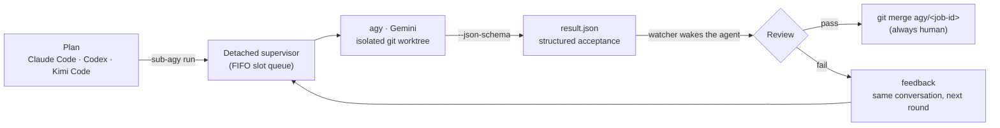

# sub-agy

> Plan in **Claude Code / Codex / Kimi Code** — execute on **Antigravity CLI** (Gemini). Official CLIs only.

**English** | [简体中文](./README-CN.md)


`sub-agy` turns the Antigravity CLI (`agy`) into an **asynchronous code-execution backend** for your planning agent. The planner writes a plan and reviews results; the heavy lifting runs in the background on your Gemini quota, inside an isolated git worktree, and comes back as a structured acceptance report.

## How it works



## Features

- **Async dispatch, background execution** — `run` returns a `job_id` immediately; a detached supervisor keeps `agy` going even after the caller exits. Jobs beyond `max_concurrent` queue up FIFO.
- **git worktree isolation** — every job runs on its own branch (`agy/<job-id>`) in its own worktree; your main branch stays clean.
- **Structured acceptance contract** — `--json-schema` makes `agy` report `summary` / `files_changed` / `tests_passed` and more.
- **Proactive completion notification** — one background watcher per job: whichever job finishes first gets reviewed first. A Stop-hook safety net (`sub-agy pending`) catches anything left unharvested.
- **Automatic feedback loop** — failed acceptance triggers `feedback`, which keeps the conversation and starts the next repair round.
- **0-token quota check** — `quota` reads the Antigravity 5h/weekly windows for free.

## Requirements

- **agy CLI ≥ 1.1.8**, logged in once interactively (run `agy` once to complete OAuth)
- **Python ≥ 3.11**
- **uv** (recommended) or pipx
- **git** (needed for worktree isolation; non-git projects fall back to in-place execution)
- **Claude Code, Codex desktop, or Kimi Code CLI** (at least one)

## Installation

### CLI (no clone needed)

```bash
uv tool install git+https://github.com/Besty0728/sub-agy
```

Verify:

```bash
sub-agy doctor
```

### Claude Code plugin

```text
/plugin marketplace add Besty0728/sub-agy
/plugin install subagy@subagy
/reload-plugins
```

### Codex desktop

No clone needed — add a git marketplace to `~/.codex/config.toml`:

```toml
[marketplaces.subagy]
source_type = "git"
source = "https://github.com/Besty0728/sub-agy"
```

Restart Codex and install `subagy` from the plugin panel.

For offline/development use, a local marketplace works too:

```toml
[marketplaces.subagy]
source_type = "local"
source = "<path to clone>"
```

### Kimi Code CLI

```text
/plugins install https://github.com/Besty0728/sub-agy
/reload
```

Commands are namespaced: `/subagy:dispatch`, `/subagy:harvest`, etc. After dispatch, each job is watched by a background `subagy-watcher` subagent that returns to the main agent the moment the job finishes. For local development use `/plugins install <path to clone>` (the plugin is copied to `$KIMI_CODE_HOME/plugins/managed/`; reinstall after editing sources).

## Quick start

### 1. Write a plan file

```bash
cat > plan.md <<'EOF'
---
scope: [src/**/*.py]
acceptance:
  - pytest tests/ -q passes
constraints:
  - no new dependencies
---
Add type annotations to the login function and fix the type errors this exposes.
EOF
```

### 2. Dispatch

In Claude Code (the main agent defaults to `gemini-3.7-flash` + `medium` effort, auto-raising to `high` for complex plans and lowering to `low` for trivial ones):

```text
/subagy:dispatch plan.md
```

Or straight from the CLI (with explicit `--effort` / `--model` if you like):

```bash
sub-agy run --plan plan.md --cwd ./my-project
```

### 3. Automatic review

When a watcher wakes the main agent, it reviews the result following the `/subagy:harvest` rules: accept, fail, or send it back for another round.

### 4. Merge

Once acceptance passes, merge the execution branch yourself:

```bash
git merge agy/<job-id>
```

### Quota check

```bash
sub-agy quota --oneline
```

Sample output (currently localized in Chinese):

```
Gemini 模型：5h 限额剩余 99.8%（32分钟后重置），7d 限额剩余 99.8%（6天11小时后重置）；Claude/GPT 模型：7d 限额剩余 100.0%
```

## CLI reference

| Command | Description |
|---|---|
| `sub-agy run --plan <plan.md>` | Dispatch a plan, returns `job_id` immediately |
| `sub-agy status [--all]` | Show job status, queue position, tokens, elapsed |
| `sub-agy result <job-id>` | Harvest the structured result of a finished job |
| `sub-agy feedback <job-id> "..."` | Send feedback, start the next repair round |
| `sub-agy watch <job-id>` | Block until the job reaches a terminal state |
| `sub-agy cancel <job-id>` | Cancel a job |
| `sub-agy list` | List jobs in the current project |
| `sub-agy pending [--under <dir>]` | List finished-but-unharvested jobs (data source for the Stop-hook safety net) |
| `sub-agy cleanup <job-id>` | Remove the job worktree and branch |
| `sub-agy quota [--oneline] [--pretty]` | Query Antigravity quota (0 tokens) |
| `sub-agy doctor` | Environment diagnostics |

## Security & compliance

- **Official-CLI process orchestration only** — sub-agy never touches model APIs and never stores or proxies API keys.
- **Fully autonomous + worktree isolation + human merge** — `agy` always starts with `--dangerously-skip-permissions` for unattended execution; the safety boundary is the isolated git worktree, the plan's scope/constraints, and the fact that `git merge` is always triggered by a human.
- **Automatic feedback, manual merge** — `feedback` re-runs with full context preserved; `git merge agy/<job-id>` is always yours to run.

## License

[MIT](./LICENSE)

Design document: [SPEC.md](./SPEC.md).
